
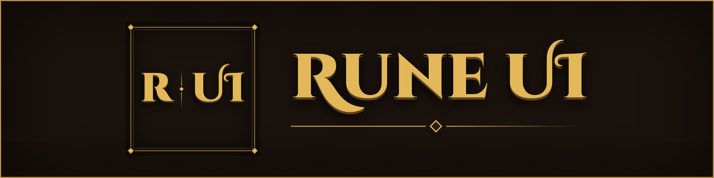

Move, resize and hide every part of the HUD, right in the game. With a new map, new rings and new bars in the game's own style.

Rune UI is a UE4SS Lua mod for RuneScape: Dragonwilds.

## Before and after

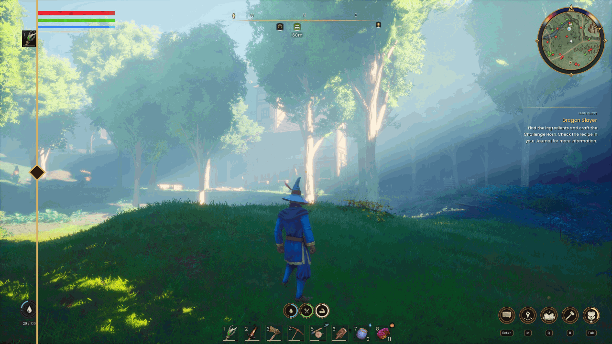

Left of the line: the game's own HUD. Right of it: Rune UI.

## What it does

<table>
<tr>
<td width="33%" valign="top">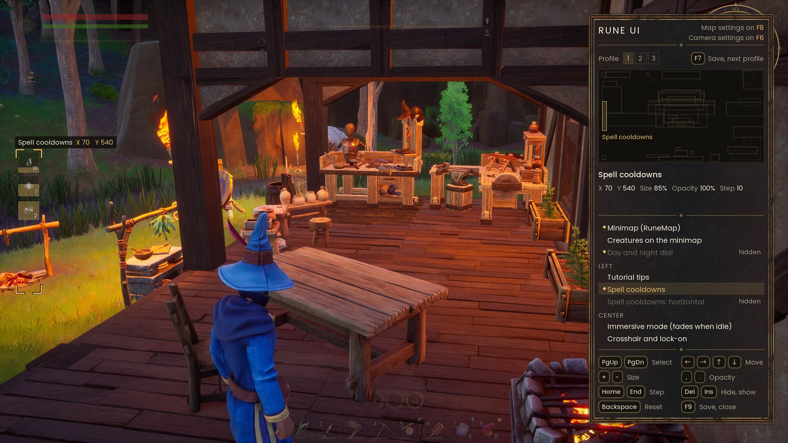 <b>Edit your HUD in the game</b> Press F9. Move, resize or hide 27 parts of the HUD with the keyboard. The mod saves your layout.</td>
<td width="33%" valign="top">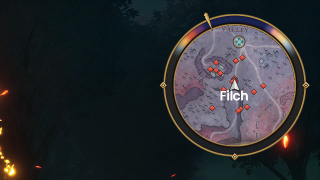 <b>RuneMap</b> A round minimap that turns with the camera. Its gold ring is also a clock. Red diamonds are enemies, green diamonds are animals.</td>
<td width="33%" valign="top">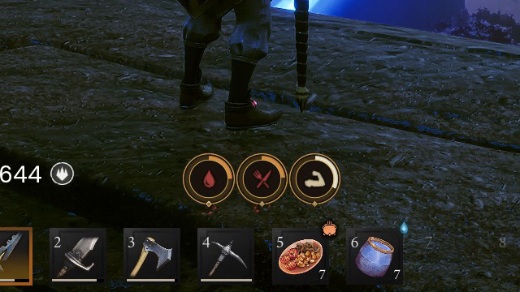 <b>Food, water and rest</b> Three rings in the style of the map. When a value gets low, they turn orange and red, like the game's own.</td>
</tr>
<tr>
<td width="33%" valign="top">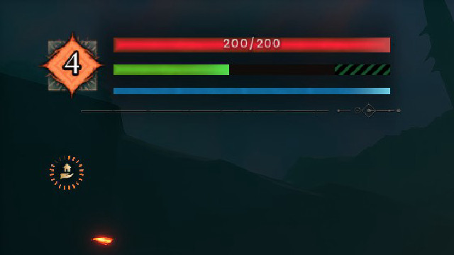 <b>Clean bars</b> Health on top, stamina in green, a plain dark track behind each bar.</td>
<td width="33%" valign="top">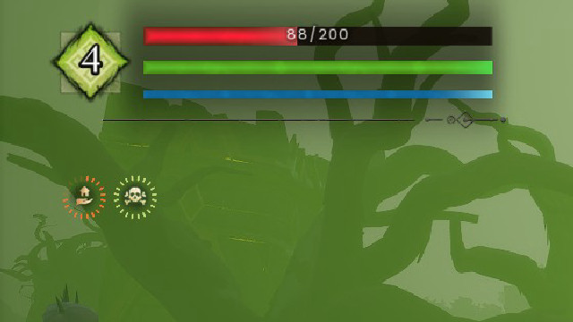 <b>Round buffs</b> Each buff is a round icon. A ring of dashes shows the time left, in the buff's own colour.</td>
<td width="33%" valign="top">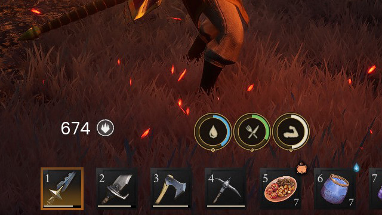 <b>Ammo counter</b> The rune and arrow count of the staff and the bow moves away from the crosshair, to where you want it.</td>
</tr>
</table>

## Install

Rune UI needs the experimental build of UE4SS. The CurseForge app installs UE4SS 3.0.1 for Dragonwilds. At the moment, that version does not start with the game, so no mod runs.

1. Download the zip whose name starts with `UE4SS_v3.0.1-` from the [UE4SS experimental release](https://github.com/UE4SS-RE/RE-UE4SS/releases/tag/experimental-latest). Do not use the `zDEV` zip.
2. Copy `dwmapi.dll` and the `ue4ss` folder from the zip into `RSDragonwilds\Binaries\Win64`. Replace the old files.
3. Copy the `RuneUI` folder to `Win64\ue4ss\Mods\`. Keep the folder name `RuneUI`: the mod finds its pictures by that name.
4. Start the game. The `enabled.txt` file in the folder turns the mod on.

If Rune UI does not show, open `Win64\ue4ss\UE4SS.log`. If the log shows "Fatal Error", UE4SS is the old version. Do steps 1 and 2 again.

If the log shows "timer: old UE4SS", your UE4SS build is older than the mod needs. The game can stutter or crash. Do steps 1 and 2 again.

When the CurseForge app installs or removes a mod, it can put UE4SS 3.0.1 back. If your mods stop working after that, do steps 1 and 2 again.

Other mods that change the HUD can conflict with Rune UI. Two mods that move the same part of the HUD fight each other.

If you used this mod before version 0.60, when its name was HudEditor: remove the `HudEditor` folder and the `HudEditor : 1` line in `mods.txt`. Rune UI reads your saved layout and map zoom from the old files.

## Keys

Press F9 in the game. A panel on the left shows the keys and every element. The selected element blinks and gets a gold frame with its name.

| Key | Action |
| --- | --- |
| PgUp / PgDn | select an element |
| Arrows | move the element |
| Home / End | change the move step (1 to 100) |
| + / - | change the size, 5% per press |
| Delete / Insert | hide / show the element |
| Backspace | reset the element to the starting layout |
| F9 | save and close the editor |
| ] / [ | zoom RuneMap in / out (this works outside the editor too) |

Beside the bars, the mod shows your level in the game's green diamond. To show your own picture there, put an `avatar.png` in the `RuneUI` folder.

"Creatures on RuneMap" and "Icons beside the bars" only switch a thing on or off. Delete and Insert work on them. The arrows and + / - do nothing.

When you hide RuneMap, the mod takes the map off the screen. The game then does not draw the map, and you get back the frames that it costs.

"Ammo counter" moves only the rune or arrow count of the staff and the bow. The crosshair stays in the middle. At first, the count is to the right of the food and water rings.

## Gallery

<table>
<tr>
<td width="33%">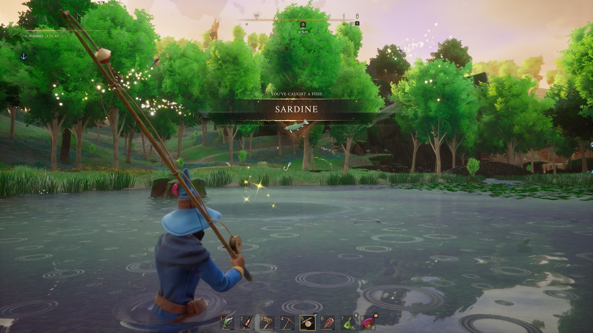</td>
<td width="33%">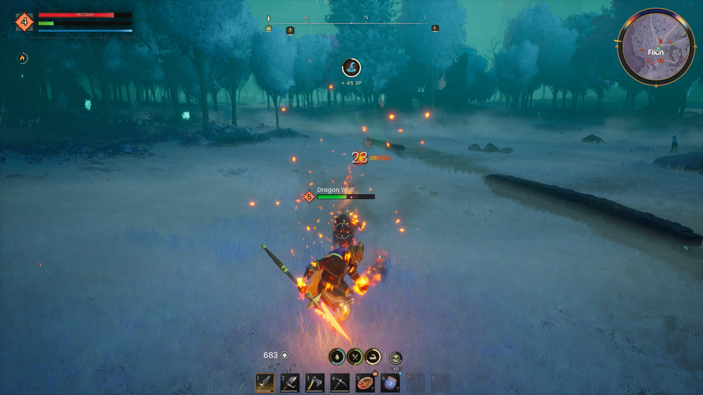</td>
<td width="33%">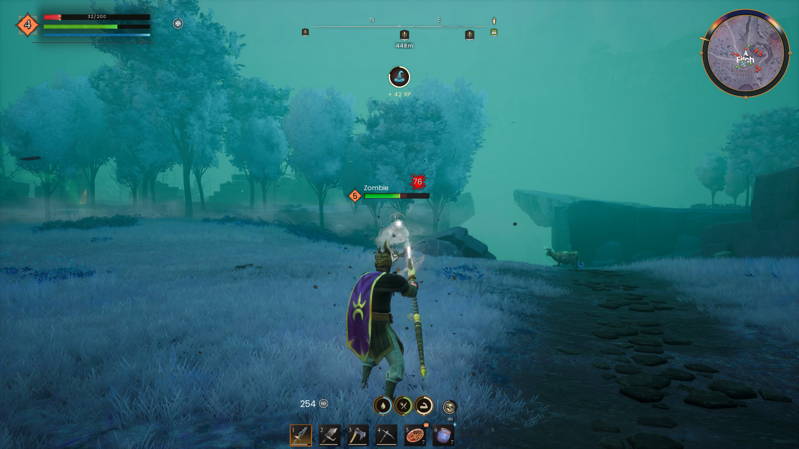</td>
</tr>
<tr>
<td width="33%">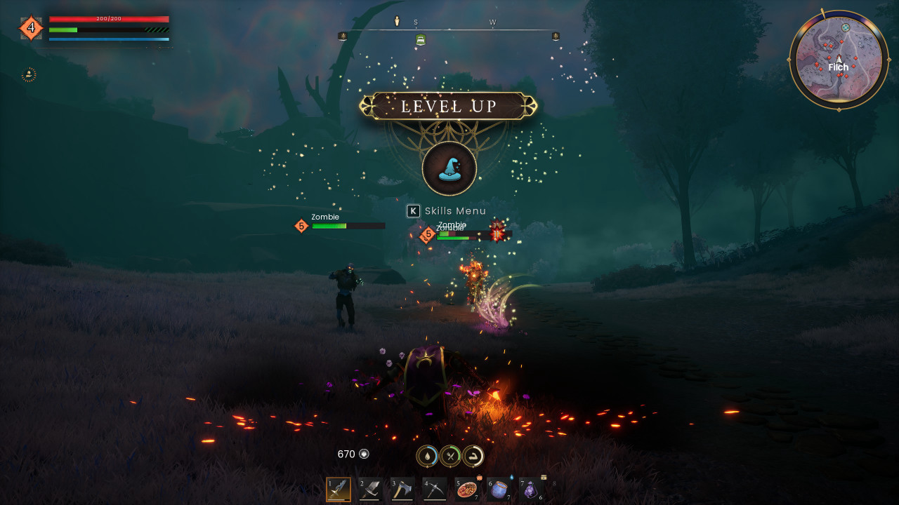</td>
<td width="33%">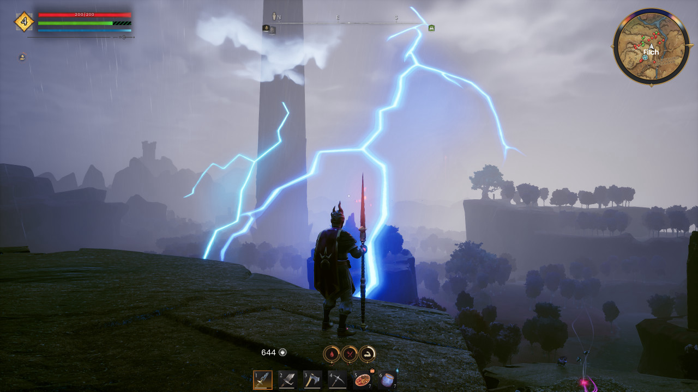</td>
<td width="33%">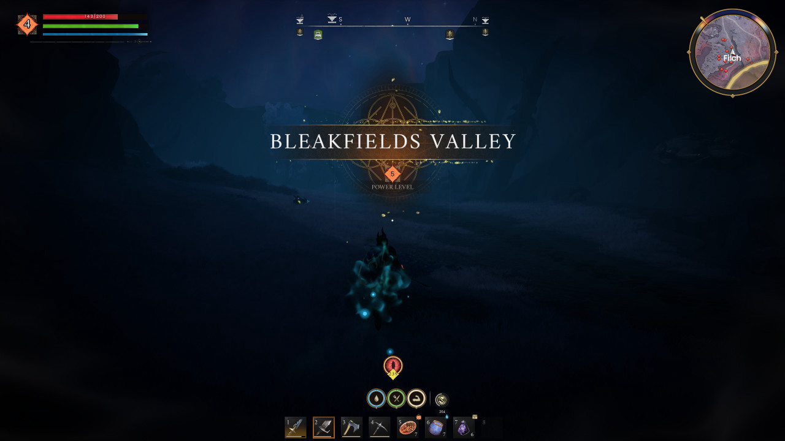</td>
</tr>
</table>

## How it works

### RuneMap

`Scripts/runemap.lua` builds a round minimap in the top right corner. It uses the game's own minimap widget, with its own map view on the player. The map turns with the camera. A gold ring around the map is also a clock: the middle of the night is at the top, and noon is at the bottom. The ring keeps the game's own share of night, about a fifth of the day. A gold needle on the ring shows the time of day.

The map shows no fog, because it has no record of the places that you visited. It shows the terrain around you as it is.

The game's minimap widget costs frames: about 20 FPS in a test, at every zoom. So the mod draws the map every second frame. This gives back about half of the cost, but the map moves a little less smoothly when the camera turns.

Creatures show as small diamonds: red for enemies, green for neutral animals. The map shows every creature that the game has loaded near you, also behind hills and walls. The diamonds are not shown on the big map (M). To hide them, hide the element "Creatures on RuneMap" in the editor. A list of animal names in `runemap.lua` decides which creatures are neutral.

The mod reads the time from the material of the game's day and night dial: `Fill Amount` is the part of the day that is gone, and `Night Start` is where the night begins. An error in the map does not stop the rest of the mod. The log shows when the map is ready, or the step that failed, with the prefix `runemap`.

### Food, water and rest

`Scripts/survival.lua` draws the three survival values in the map's style: a gold rim, a coloured ring that fills with the value, the game's icon in a dark centre and a diamond under it. The game's own rings stay in place but are not visible. The mod reads the values from the game's numbers. When a value is low, the game turns its icon red and its ring orange (25 or less) or dark red (10 or less). The mod's ring and icon take the same colours, a little brighter so they still show.

### Bars

Each bar is a plain box: a dark track behind the fill. The health bar is on top and the stamina bar under it. The stamina fill is green; the other fills keep the game's colours. The icons beside the bars are hidden. To show them, show "Icons beside the bars" in the editor.

### Buffs

Each buff is a round icon with 20 short dashes around it. The dashes show the time that is left. They take the buff's colour from the game, for example green for poison.

### Speed

Every 2 s, the mod finds the parts of the HUD with one search of all widgets. The time of a search depends on the UE4SS build. In a test, a search took about 15 ms with a recent experimental build. An older build reads every object in the game, and a search took 50 ms or more.

To see a world change, the mod reads the controller of the local player on every step. It does not search for it.

The timer of the mod runs on the game thread, with `LoopInGameThreadWithDelay`. An older UE4SS does not have this function. Then the log shows "timer: old UE4SS", and the timer uses two threads. Two threads in one Lua state can crash the game.

Once a minute, the log gets a line that starts with `perf:`. It shows the time of the mod's steps and searches, the number of widgets that the mod moves, and the memory that Lua uses.

### Files that the mod writes (in `Win64`)

- `runeui_layout.txt`: the saved layout. Each line holds one element: `id:X,Y,size,visible`.
- `runeui_menuart.txt`: the pictures and the font of the main menu, for the editor panel. The mod writes this file while the main menu is open.
- `runeui_mapzoom.txt`: the zoom of RuneMap.

When the game starts, the mod also writes its pictures into `ue4ss/Mods/RuneUI/Art`. It writes a picture only when it is missing or different.

The mod does not use the network and does not start other programs.

## For developers

The pictures are in `RuneUI/Art`: the day band, the needle, the diamonds, the creature diamonds, the survival rings, the bar tracks and the dash of the buff rings. `tools/make-runemap-art.js` draws them. Run `node tools/make-runemap-art.js` again after you change a colour or a size in it. The band is drawn for the game's night start of 0.795. If the game changes that value, the log says so.

CurseForge does not accept `.png` files in a Dragonwilds mod. So the tool also writes all the pictures into `RuneUI/Scripts/art.lua` as base64 text. When the game starts, the mod writes them back into `RuneUI/Art`. `RuneUI/Art/readme.txt` keeps the `Art` folder in the zip. `node tools/check-art.js` checks that the mod writes the pictures back byte for byte. It needs `npm install --no-save fengari` first.

`node tools/make-zip.js` builds the release zip, `RuneUI-<version>.zip`, in the repo root. The same zip goes to CurseForge and Nexus Mods. It adds `LICENSE` as `LICENSE.txt` and leaves out the `.png` files. It stops if the zip would hold a file type that CurseForge does not accept. `RuneUI/README.txt` is the short README for players inside the zip. When you change the install steps or the keys here, change them there too.

`node tools/check-lua.js` checks the Lua files without the game: the syntax, that every global name is a Lua or UE4SS one, and that no top-level local name is declared twice. It needs `npm install --no-save luaparse` first.

The pictures of this README are in `docs`.

## Thanks

To Eravex for [Move it Move it](https://www.nexusmods.com/runescapedragonwilds/mods/208), and to Mathayus for [Mini Map](https://www.curseforge.com/runescape-dragonwilds/ue4ss-mods/mini-map). Their mods got me started, and gave me the idea to build a HUD I could move and shape myself.

## Licence

The code of Rune UI is under the MIT licence. See `LICENSE`.

Created using intellectual property belonging to Jagex Limited under the terms of Jagex's Fan Content Policy. This content is not endorsed by or affiliated with Jagex.
