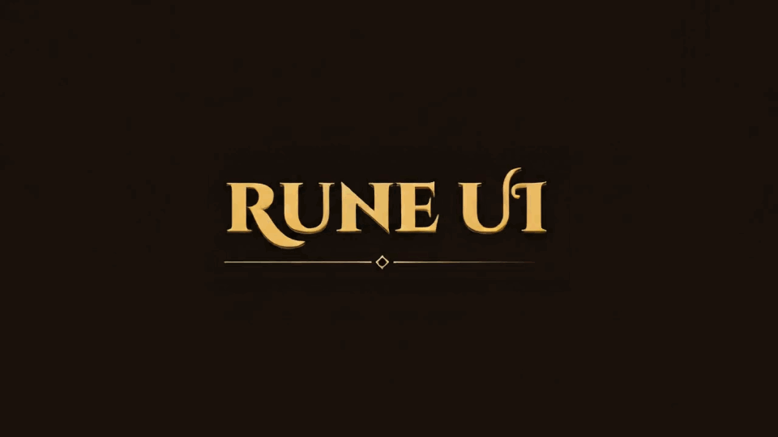
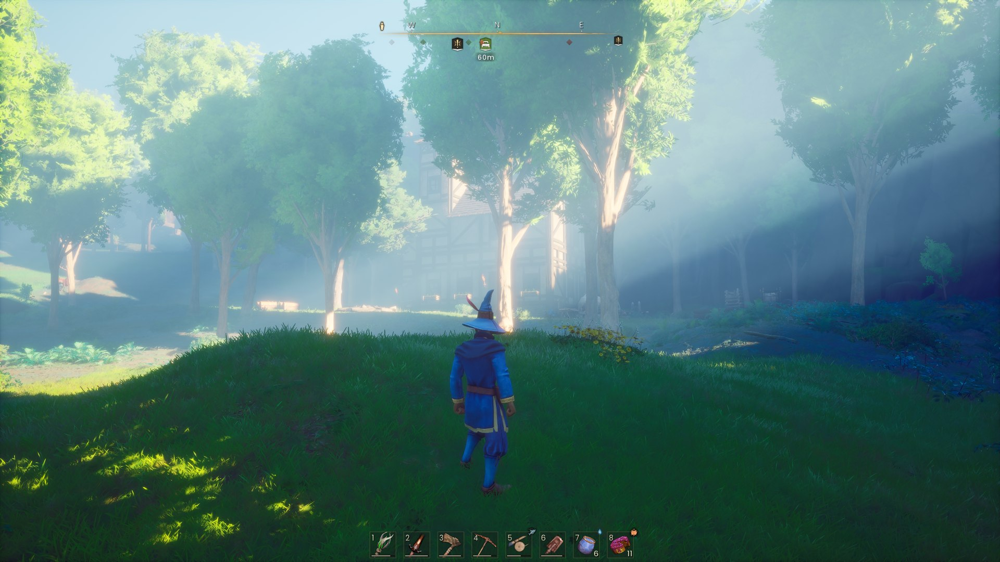
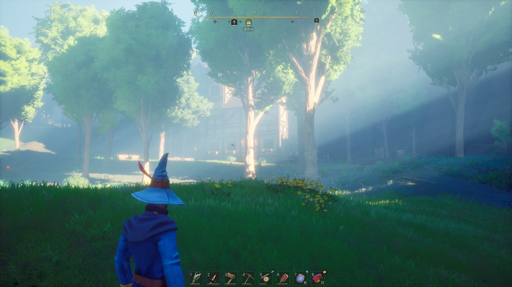
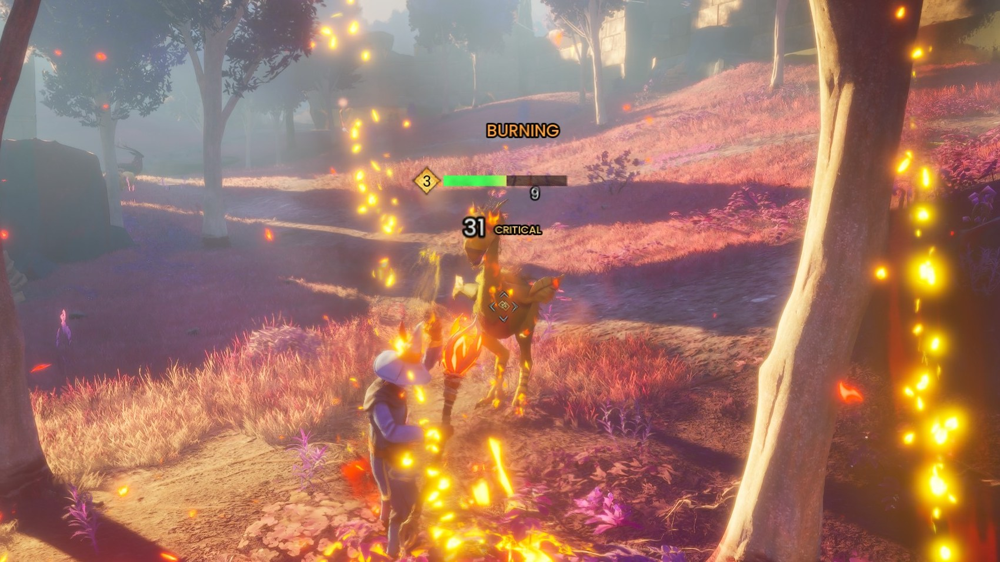
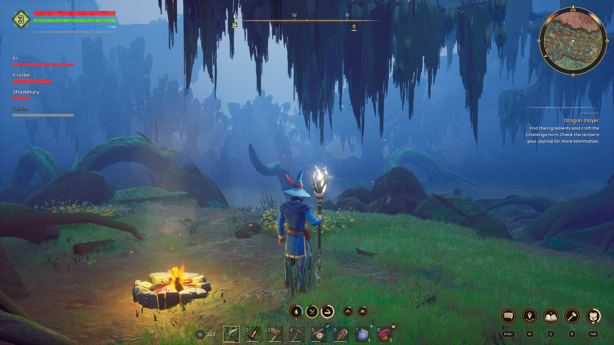
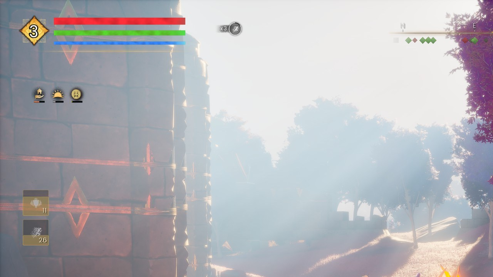
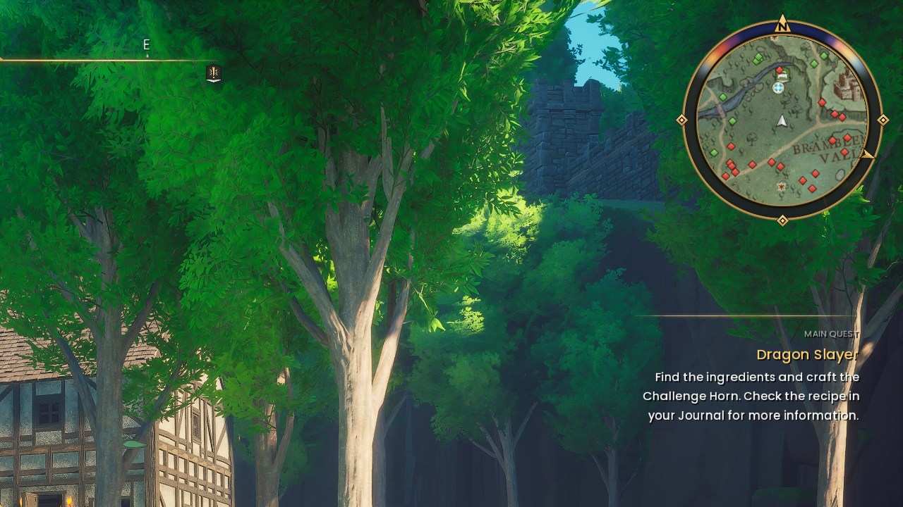
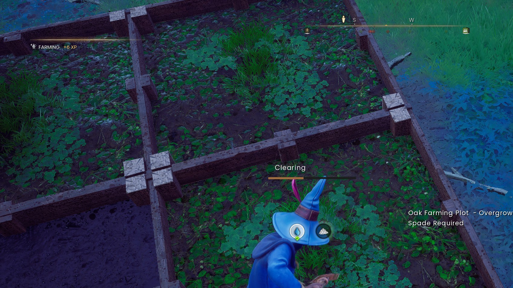
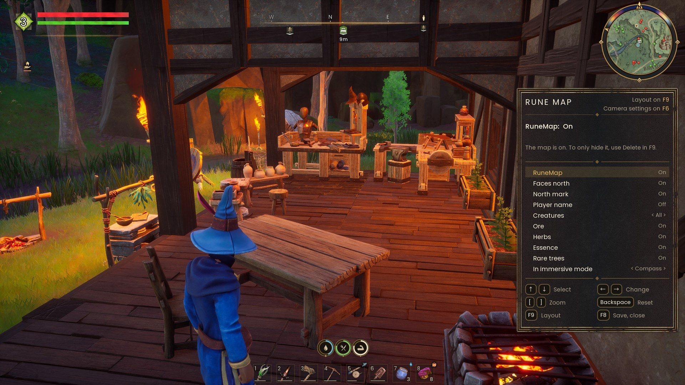
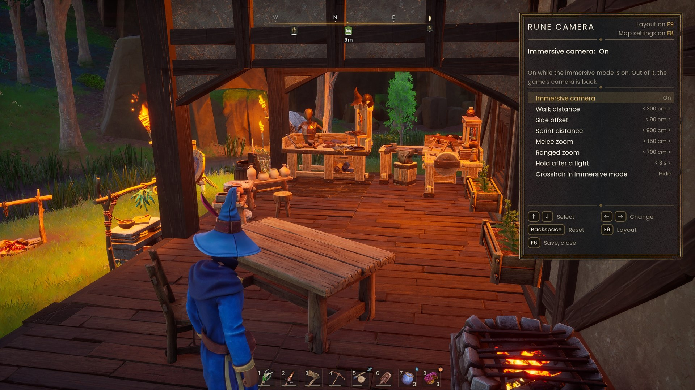

A big overhaul of the vanilla UI, built in the game's own style. Move, resize, fade or hide 35 HUD parts and switch between 3 profiles, all in the game with no files to edit. The minimap, bars, buffs, party panel, wheels and notices are redesigned too.

Rune UI is a UE4SS Lua mod for RuneScape: Dragonwilds.

## Before and after

Left of the line: the game's own HUD. Right of it: Rune UI.

## What you get

<table>
<tr>
<td width="50%" valign="top"> <b>Immersive mode</b> The HUD fades away when nothing happens, and comes back when you need it.</td>
<td width="50%" valign="top"> <b>Immersive camera</b> A closer, over-the-shoulder camera, with or without immersive mode.</td>
</tr>
<tr>
<td width="50%" valign="top"> <b>Combat text, enemy and boss bars</b></td>
<td width="50%" valign="top"> <b>Party panel</b> Have fun with your friends, even the ones who are scared of the dark.</td>
</tr>
<tr>
<td width="50%" valign="top"> <b>Buffs, debuffs and spell cooldowns</b></td>
<td width="50%" valign="top"> <b>Minimap and quest log</b> Each with its own options.</td>
</tr>
<tr>
<td width="50%" valign="top"> <b>Farming and XP</b> Smaller, redesigned farm plot icons, and a new XP bar.</td>
<td width="50%" valign="top"> <b>The editor</b> Press F9. Pick a part, then move it, resize it, fade it or hide it.</td>
</tr>
<tr>
<td width="50%" valign="top"> <b>The map settings</b> Press F8.</td>
<td width="50%" valign="top"> <b>The camera settings</b> Press F6.</td>
</tr>
</table>

## How to use it

- **F9** opens the editor. Pick a part, then move it, resize it, fade it or hide it. The editor lists its keys. The mod saves your layout.
- **F7** in the editor saves the layout and goes to the next of three profiles.
- **F5** opens Rune Skin: the switches of the looks.
- **F8** opens the Rune Map settings.
- **F6** opens the immersion mode settings, with the camera.

Every key and setting is in `README.txt` in the mod folder.

## Install

The CurseForge app installs UE4SS 3.0.1 for Dragonwilds. At the moment, that version does not start with the game, so no mod runs. Use the newer UE4SS build:

1. Go to the [UE4SS experimental release](https://github.com/UE4SS-RE/RE-UE4SS/releases/tag/experimental-latest) on GitHub.
2. Download the zip whose name starts with `UE4SS_v3.0.1-`. Do not use the `zDEV` zip.
3. Open the game folder: `Steam\steamapps\common\RSDragonwilds\RSDragonwilds\Binaries\Win64`
4. Copy `dwmapi.dll` and the `ue4ss` folder from the zip into `Win64`. Replace the old files.
5. Copy the `RuneUI` folder into `Win64\ue4ss\Mods`. Keep the name `RuneUI`.
6. Start the game and press F9.

Other mods that change the HUD can conflict with Rune UI.

### Rune UI does not show?

Open `Win64\ue4ss\UE4SS.log`. If it says "Fatal Error", UE4SS is the old version. Do steps 1 to 4 again.

When you install or remove a mod with the CurseForge app, the app can put the old UE4SS back. If your mods stop working after that, do steps 1 to 4 again.

## Gallery

## More

What changed in each version: [CHANGELOG.md](CHANGELOG.md).

## Thanks

To Eravex for [Move it Move it](https://www.nexusmods.com/runescapedragonwilds/mods/208), and to Mathayus for [Mini Map](https://www.curseforge.com/runescape-dragonwilds/ue4ss-mods/mini-map). Their mods got me started, and gave me the idea to build a HUD I could move and shape myself.

To Taylor Powell (tcpowell) for the idea and the first code of the map setting "Player name".

## Licence

Rune UI is free to use, and its code is open to read. You may change it and send your change to the author. You may not upload it again, publish a changed version, or use parts of it in another mod without the written permission of the author. Versions 1.0 to 1.6 stay under the MIT licence. See `LICENSE`.

To send a change, fork the repository and open a pull request. If the author accepts it, the change becomes a part of Rune UI. The author names you in this README and as co-author of the commit.

Created using intellectual property belonging to Jagex Limited under the terms of Jagex's Fan Content Policy. This content is not endorsed by or affiliated with Jagex.
